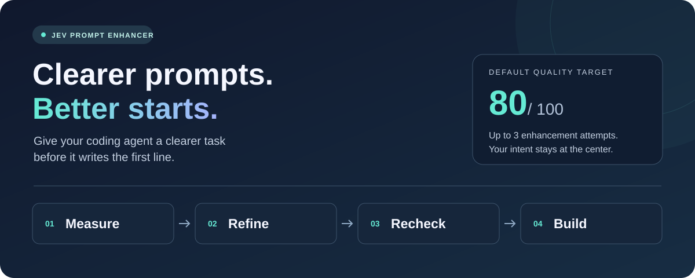

<p align="center">
  
</p>

# Enhance your prompts using Jev

**Less guesswork. Clearer instructions. More room to build.**

Give your coding agent a clearer task before it writes the first line. Jev evaluates your prompt and pinpoints where the task, context, constraints, or expected output need more clarity. This skill uses that feedback to sharpen your instructions, then continues with the work you asked for.

Whether you're fixing a bug, building a feature, or requesting a code review, the payoff is fewer rounds of "that's not what I meant." Your requirements and scope stay intact; your agent gets more actionable instructions.

<p align="center">
  <a href="#setup">Get started</a> &nbsp; &middot; &nbsp;
  <a href="#usage">Try it out</a> &nbsp; &middot; &nbsp;
  <a href="skills/jev-prompt-enhancer/SKILL.md">Explore the skill</a>
</p>

## From intent to action

| 🎯 Measure | ✨ Refine | 🔁 Recheck | 🛠️ Build |
| :--- | :--- | :--- | :--- |
| Get a quality score and focused feedback from Jev. | Address the weak spots while preserving your intent. | Measure again against the quality target. | See the resulting prompt, then continue with your task. |

The loop stops at **80/100 by default** (or a threshold you specify), or when all **three enhancement attempts** are used. At the limit, the skill selects the highest-scoring prompt.

## A clearer brief for every task

- **Fix bugs with focus.** Make the problem, relevant context, and constraints easier to act on.
- **Build with shared expectations.** Clarify what the feature should do and what the result should look like.
- **Give reviews direction.** Sharpen the review request without expanding its scope.

> **Your intent, preserved.** The skill improves how you ask while keeping what you asked for at the center.

---

## Setup

Use Bash and Node.js 18 or newer. No npm dependencies are required.
On Windows, use Git Bash.

Set `JEV_API_KEY` in the environment used to launch your agent:

```sh
export JEV_API_KEY='your-typesafe-api-key'
```

Alternatively, copy `.env.example` to `.env` in the repository root and set
`JEV_API_KEY` there. Run the script from that project root, or set `JEV_ENV_FILE`
to the absolute path of its `.env`, including when the skill is installed elsewhere.
When the environment key is missing or empty, the script reads only literal,
single-line `JEV_API_KEY` assignments. Unquoted values without whitespace,
single/double quotes, optional `export`, and trailing `#` comments are supported.
Shell commands, variable expansion, and escape processing are never executed.
An existing nonempty environment key takes precedence. Never commit real API keys.

## Usage

Invoke `$jev-prompt-enhancer` with your task. The agent measures the prompt, revises
it when needed, and proceeds when it reaches 80/100 or uses all three attempts.
Debug logs are written under `logs/jev-prompt-enhancer/` in the working workspace.

To measure a prompt directly from the repository root:

```sh
bash skills/jev-prompt-enhancer/scripts/measure.sh <<'JSON'
{"prompt":"Summarize the provided text in three bullet points.","context":""}
JSON
```

## Verification

```sh
npm test
```

The checks mock Jev requests and do not require a real API key or network access.
